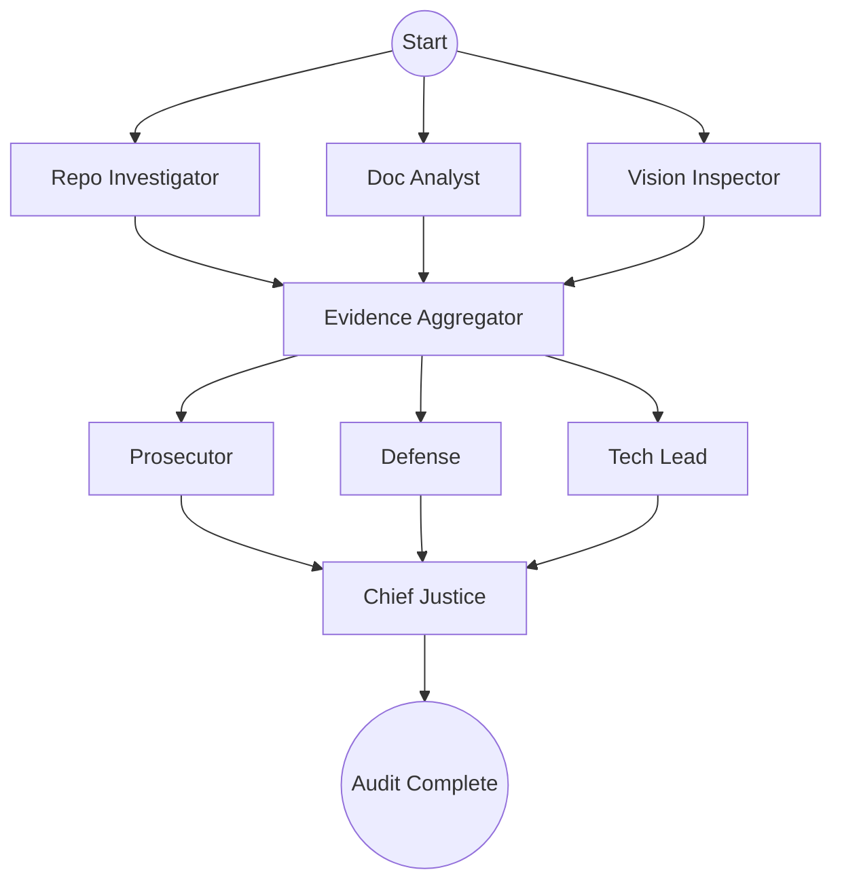

# Automaton Auditor Architecture

## Overview

The Automaton Auditor is a multi-agent system designed to perform automated security and quality audits on AI codebases. It follows the **Digital Courtroom** protocol, where agents take on specific judicial roles.

## Core Concepts

### Dialectical Synthesis

The system does not simply average scores. Instead, the **Chief Justice** node performs _Dialectical Synthesis_. It takes the opposing views of the Prosecutor (focus on rigor/security) and the Defense (focus on intent/effort) and synthesizes them into a nuanced final verdict.

### Metacognition

The system evaluates its own certainty. Nodes like the `doc_analyst` report confidence levels, and the Chief Justice uses these to weight arguments or flag dissents.

## Graph Orchestration (Parallel Flow)

## State Management

The system uses a **StateGraph** with a `TypedDict` state.

- **Fan-Out**: Multiple detectives run in parallel.
- **Fan-In / Reducers**: Evidence and Opinions are collected using `operator.ior` and `operator.add` to prevent state collisions.

## Safe Tool Engineering

- **Sandboxing**: Repositories are cloned into temporary directories (`tempfile.TemporaryDirectory`).
- **Secure Fallbacks**: When system tools like `git` are unavailable, secure fallbacks using `curl` and `unzip` are utilized to ensure continuity without compromising the host.
