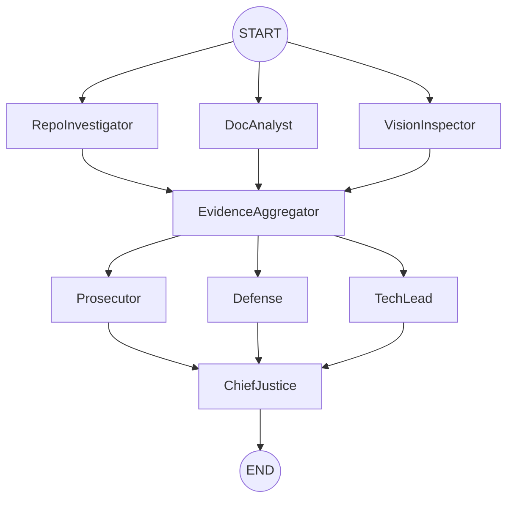

# Interim Report: The Automaton Auditor

**Date**: February 24, 2026
**Author**: Eyobed Feleke

## 1. Architecture Decisions

### Pydantic vs. Dicts

We chose **Pydantic BaseModels** for state definitions to enforce strict schema validation. This prevents "Dict Soups" where field names might be misspelled or types might be inconsistent between parallel nodes. It also simplifies structured output generation from LLMs using `.with_structured_output()`.

### AST Parsing Strategy

Instead of brittle Regex, we implemented **AST (Abstract Syntax Tree)** parsing in `RepoTools`. This allows the `RepoInvestigator` to verify the actual structural existence of `StateGraph` instantiations and `add_edge` calls, ensuring the auditor isn't fooled by comments or mock strings.

### Sandboxing Strategy

To ensure safety while auditing external code, we use `tempfile.TemporaryDirectory()` for all `git clone` operations. This ensures that the code under review never interacts with the auditor's runtime environment or live working directory.

## 2. Planned Multi-Agent Flow

The system employs a **Hierarchical State Graph** with two major fan-out/fan-in phases:

1.  **Detective Phase (Fan-Out)**: `RepoInvestigator`, `DocAnalyst`, and `VisionInspector` run in parallel to gather evidence.
2.  **Evidence Aggregation (Fan-In)**: Collects all `Evidence` objects into a unified state.
3.  **Judicial Phase (Fan-Out)**: `Prosecutor`, `Defense`, and `TechLead` analyze the evidence independently.
4.  **Synthesis (Fan-In)**: `ChiefJustice` resolves conflicts using deterministic rules.

## 3. Known Gaps & Concrete Plan

- **VisionInspector Implementation**: Currently a placeholder node. The plan is to integrate Google Gemini Pro Vision or GPT-4o to analyze architectural diagrams extracted from the PDF.
- **Synthesis Nuance**: The `ChiefJustice` currently uses a weighted average with basic security overrides. We plan to implement more sophisticated "Constitutional AI" logic to resolve deep dialectical conflicts.
- **RAG-lite for PDF**: Current PDF parsing is basic keyword search. We plan to implement a chunked vector-based search for better context retrieval.

## 4. StateGraph Visualization

